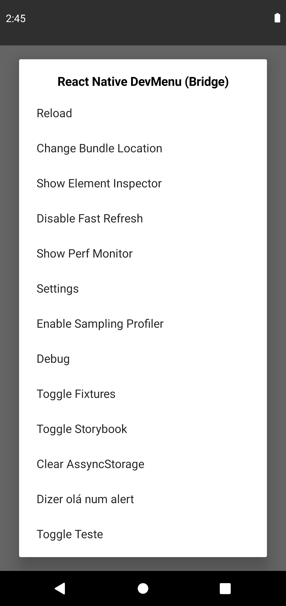

# react-native-add-items-in-dev-menu

Package to add items in dev menu for toggle funcionalities

## Installation

```sh
npm install react-native-add-items-in-dev-menu
```

## Usage

```js
import { useDevSettings } from "react-native-add-items-in-dev-menu";

// ...
const { loading, state } = useDevSettings([
    {name: "Title to show in dev menu"},
    {name: "Fixtures"},
    {name: "Clear AssyncStorage", action: async () => await AsyncStorage.clear()},
    {name: "Say hello", action: () => Alert.alert("Hello!")}
])
/*
    Value of the variable state:
    {"useTitleToShowInDevMenu": false, "useSayHello": false}
*/

// ...
const isShowTitle = state.useTitleToShowInDevMenu

if (loading) {
    return <View />
}

return (
    <View>
        <Text>{isShowTitle ? 'Title enabled' : 'Title disabled'}</Text>
        ...
    </View>
)
```
## Example

<p>
  
</p>

readme in construction...
